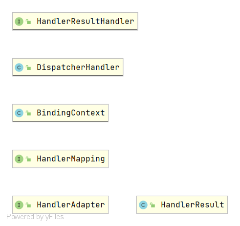
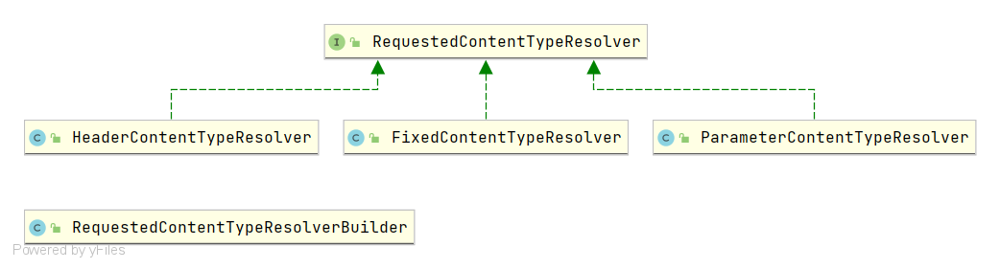
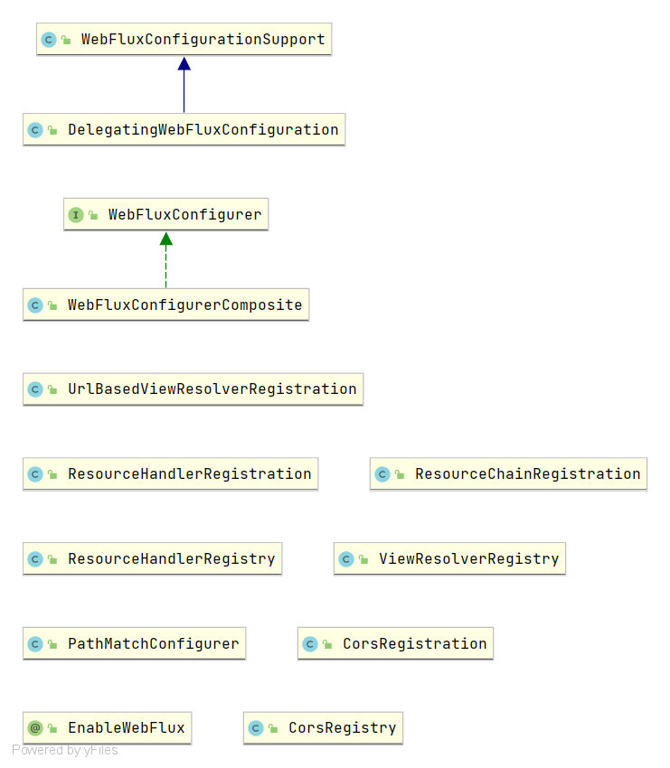
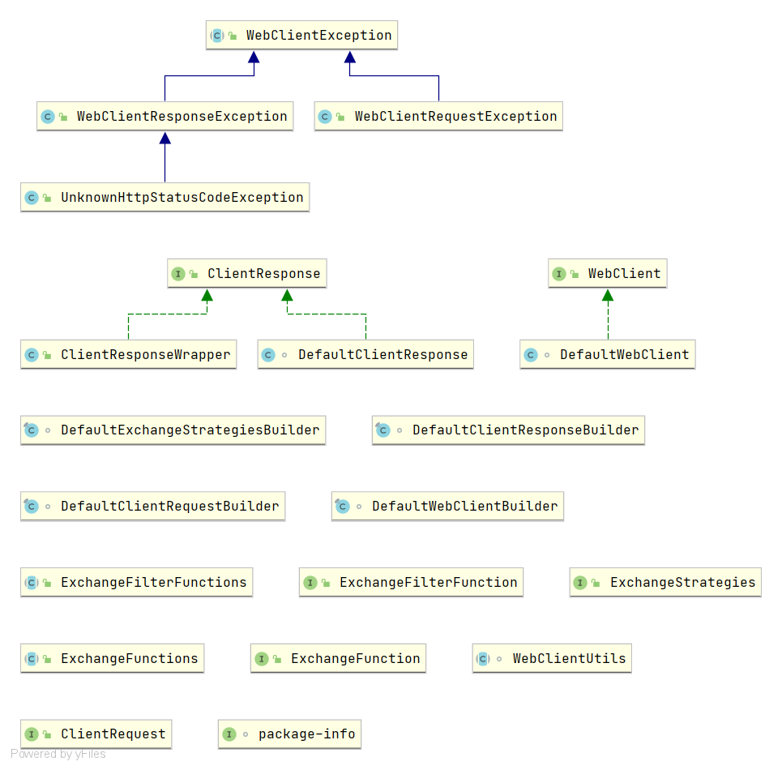
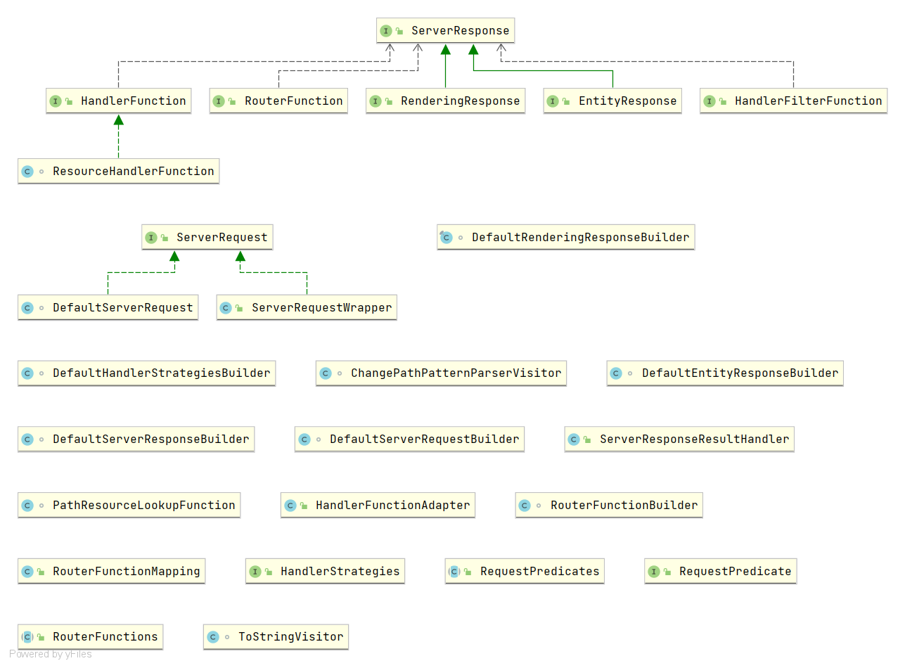
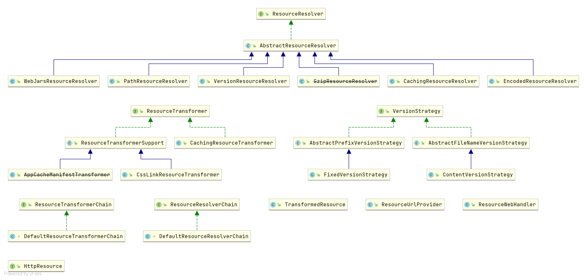
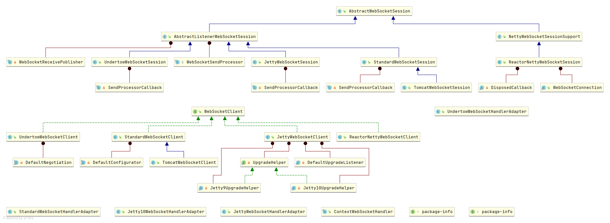
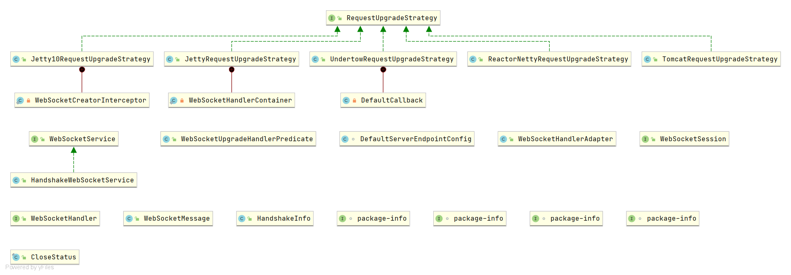

[TOC]

# UML架构图

## WebFlux

### Base

### Accept

### Config

### Function.Client

### Function.Server

### Resource

### Websocket-client

### Websocket-Server

# 依赖库

## Project-React

[projectReacot](./projectReacot.md)

